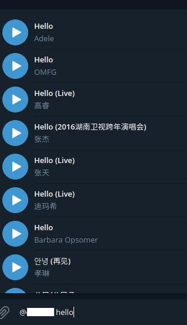

# TelegramMusicBot

[](https://travis-ci.com/wotmshuaisi/TelegramMusicBot)

telegram music bot based on golang

## Screenshot



## Configuration

```shell
export TELEGRAM_TOKEN=xxxxxxxxxx // token
export TELEGRAM_DEBUG=[True / False] // debug mode
```

## To add New Api

follow this interface

```golang
type API interface {
    ListItem(text string) (*[]*Item, error)
}
```

## dependencies

- [telegram-bot-api](https://github.com/go-telegram-bot-api/telegram-bot-api)
- kugou api